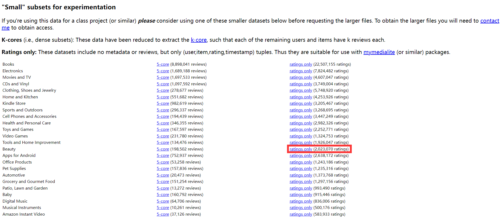
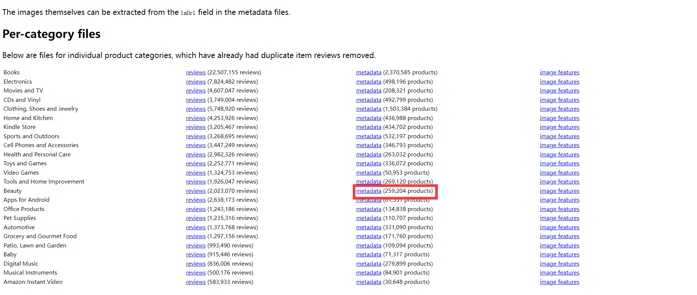

# Mamba4Rec复现-无需Recbole环境

作者: 范昊

author: Hao Fan

## 简介
本仓库在非Recbole环境下复现了[Mamba4Rec](https://arxiv.org/abs/2403.03900)模型的性能，并提供了Amazon 2014数据集的预处理方法。
- `模型`: 本仓库从MambaBlock开始一步步重构了Mamba4Rec模型结构（作者能力所限，无法实现selective_scan_cuda，涉及cuda编程），同时给出了详细注释，并参考Recbole序列推荐模型，实现了模型训练与预测逻辑；
- `数据集`: 本仓库针对Amazon 2014评论数据集实现了序列推荐的数据预处理流程。
---
## 引用
- Mamba4Rec模型结构实现参考自Mamba4Rec官方源码： [https://github.com/chengkai-liu/Mamba4Rec](https://github.com/chengkai-liu/Mamba4Rec)；
- 重构MambaBlock参考自:
  - Mamba源码：[https://github.com/state-spaces/mamba](https://github.com/state-spaces/mamba)；
  - Mamba-Py源码：[https://github.com/alxndrTL/mamba.py](https://github.com/alxndrTL/mamba.py)；
- 序列推荐模型训练以及预测逻辑实现参考自Recbole源码：[https://github.com/RUCAIBox/RecBole](https://github.com/RUCAIBox/RecBole)；
- Amazon 2014评论数据集预处理实现参考自MMSRec源码：[https://github.com/kz-song/MMSRec](https://github.com/kz-song/MMSRec)；
- Hit和NDCG评价指标实现参考自TiCoSeRec源码：[https://github.com/KingGugu/TiCoSeRec](https://github.com/KingGugu/TiCoSeRec)。

Mamba4Rec论文bibtex引用如下：
```
@article{liu2024mamba4rec,
      title={Mamba4Rec: Towards Efficient Sequential Recommendation with Selective State Space Models}, 
      author={Chengkai Liu and Jianghao Lin and Jianling Wang and Hanzhou Liu and James Caverlee},
      journal={arXiv preprint arXiv:2403.03900},
      year={2024}
}
```
---
## 基础环境要求
- Linux（本案例使用Ubuntu-22.0.4发行版本）
  - 请先确定系统的GLIBC版本大于等于2.32（本案例使用2.35）， 否则会导致python无法正常import动态链接库（python >= 3.7 import动态链接库需要 GLIBC >= 2.32），
  如需查看GLIBC版本可使用以下命令查看：
  ```shell
  ldd --version
  ```
- Python >= 3.9（or 3.8?） （本案例使用python-3.10）
- CUDA >= 11.6 （本案例使用CUDA-11.8）
- Pytorch >= 1.12.1 （本案例使用torch-2.3.0）
- jsonlines == 2.0.0
- Mamba （如遇安装问题，可参考：[https://github.com/AlwaysFHao/Mamba-Install](https://github.com/AlwaysFHao/Mamba-Install) ）
  - causal_conv1d >= 1.2.0 （非必须，可用Conv1d加Padding方式平替，本案例使用causal_conv1d-1.2.0）
  - mamba_ssm >= 1.2.0 （本案例使用mamba_ssm-1.2.0）
---
## 数据集准备
本仓库提供了Amazon Review 2014 数据集（官网：[https://jmcauley.ucsd.edu/data/amazon/index_2014.html](https://jmcauley.ucsd.edu/data/amazon/index_2014.html)）的预处理方法，
但官网现在无法下载商品元数据，替代方案是访问：[https://jmcauley.ucsd.edu/data/amazon/links.html](https://jmcauley.ucsd.edu/data/amazon/links.html)，如遇自动跳转2018数据集，请多次尝试返回，停止页面自动请求转发。
之后找到想要下载的数据集后，分别下载对应的`ratings_{Name}.csv`以及`meta_{Name}.json.gz`文件。
### Beauty数据集为例
- `ratings_Beauty.csv`：在界面中找到对应的文件并下载，对应下载链接为：[http://snap.stanford.edu/data/amazon/productGraph/categoryFiles/ratings_Beauty.csv](http://snap.stanford.edu/data/amazon/productGraph/categoryFiles/ratings_Beauty.csv)
  <p align="center">
    
  </p>

- `meta_Beauty.json.gz`：在界面中找到对应的文件并下载，对应下载链接为：[http://snap.stanford.edu/data/amazon/productGraph/categoryFiles/meta_Beauty.json.gz](http://snap.stanford.edu/data/amazon/productGraph/categoryFiles/meta_Beauty.json.gz)
  <p align="center">
    
  </p>
下载完成后，在`📁 dataset\amazon\raw\`下新建`📁 Beauty`，将`ratings_Beauty.csv`和`meta_Beauty.json.gz`放入`📁 dataset\amazon\raw\Beauty`中即可，
其他分类的下载也参考以上步骤。

---
## 项目结构介绍
- `📁 assert`：存放Readme文档的图片；
- `📁 dataset`：存放各类数据集以及数据集预处理文件：
  - `📁 amazon`：亚马逊数据集以及对应预处理文件：
    - `📁 preprocess`：存放数据预处理文件：
      - `process_item.py`：数据预处理脚本，可自动扫描`📁 raw`下的子类别原始数据并处理；
      - `utils.py`：数据预处理工具函数等；
    - `📁 processed`：预处理完的数据集文件：
      - `📁 Beauty`：Beauty数据集的预处理文件：
        - `train_seq.jsonl`：训练集子序列；
        - `eval_seq.jsonl`：验证集子序列；
        - `test_seq.jsonl`：测试集子序列；
        - `item2id.jsonl`：原始item id到新id的映射；
        - `user2id.jsonl`：原始user id到新id的映射；
    - `📁 raw`：原始未处理数据，按照子类别划分：
      - `📁 Beauty`：Beauty数据集的原始未处理文件：
        - `ratings_Beauty.csv`：交互数据；
        - `meta_Beauty.json.gz`：商品元数据；
        - 
努力编写ing，请等待更新...

---
## Usage
努力编写ing，请等待更新...

